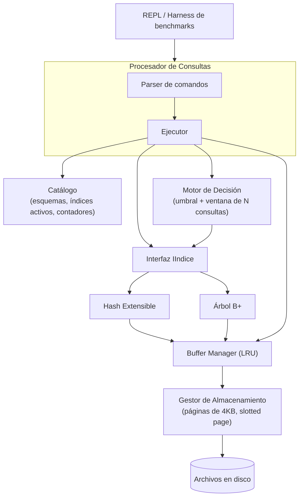

# adaptive-minisgbd

Un mini Sistema Gestor de Base de Datos en C++ que **elige automáticamente qué tipo de
índice construir** (Hash Extensible o B+ Tree) según el patrón de consultas que observa en
cada columna, sin que el programador tenga que decidirlo a mano.

> Trabajo final del curso **Base de Datos II** — Escuela Profesional de Ciencias de la
> Computación, **Universidad Nacional de San Agustín de Arequipa**.

## La idea

Los SGBD tradicionales obligan al programador a elegir de antemano qué estructura de
índice usar para cada columna. Este proyecto propone que el propio sistema lo decida solo:

- Monitorea, por columna, cuántas consultas son de **igualdad** (`WHERE col = valor`) y
  cuántas son de **rango** (`WHERE col ENTRE v1 Y v2`, `>`, `<`).
- Cuando un patrón domina claramente (≥70% de una ventana de 20 consultas), construye el
  índice correspondiente **de forma perezosa** — recién cuando se justifica, no de antemano.
- Si el patrón es mixto y todavía no hay índice, elige B+ Tree por defecto: a diferencia
  de Hash, un B+ Tree resuelve una consulta puntual razonablemente bien aunque no sea
  óptimo, mientras que Hash no puede resolver un rango en absoluto.

**Resultado medido** (barrido completo 0%–100% de consultas puntuales, 2000 consultas por
punto sobre 20 000 filas — ver [`benchmarks/resultados_benchmark.csv`](benchmarks/resultados_benchmark.csv)):
la selección automática **nunca es la peor estrategia en ningún punto del espectro**,
mientras que cada índice fijo (Hash o B+Tree) sí lo es en el extremo contrario a su
fortaleza.

| Proporción puntual | Sin índices | Hash fijo | B+Tree fijo | **Automático** |
|---:|---:|---:|---:|---:|
| 0.0 (100% rango)   | 6390 ms | 3278 ms | 1093 ms | 1279 ms |
| 0.5 (mixta)        | 6736 ms | 1697 ms | 1140 ms | 5662 ms |
| 1.0 (100% puntual) | 6213 ms | **58 ms** | 1118 ms | 188 ms |

*(tiempo total para 2000 consultas `SELECT ... WHERE`; ver la tabla completa de 11 puntos y
el análisis en [`docs/diseno_sistema.md`](docs/diseno_sistema.md#9-experimentos-y-resultados))*

## Arquitectura



Todos los archivos (tabla de datos + cada índice) comparten el **mismo buffer pool** —
igual que en un SGBD real, no uno por archivo.

## Uso rápido

Requiere `g++` con soporte de C++17 (probado con MinGW/MSYS2 en Windows; el `Makefile`
funciona igual en Linux/macOS).

```powershell
# Windows (PowerShell)
.\build.ps1 -Correr      # compila y corre las 4 suites de test
.\build.ps1 -Benchmark   # corre el experimento completo (~1-2 min)
.\bin\minisgbd.exe       # REPL interactivo
```

```bash
# Linux / macOS
make test    # compila y corre las 4 suites de test
make bench   # corre el experimento completo
make && ./bin/minisgbd.exe
```

### Ejemplo de sesión interactiva

```
sgbd> CREAR TABLA empleados (id:ENTERO, nombre:TEXTO(20), salario:ENTERO)
OK.
sgbd> INSERTAR EN empleados VALORES (1, 'ana', 3200)
OK.
sgbd> SELECCIONAR * DE empleados DONDE id = 1
(1, ana, 3200)
1 fila(s).
sgbd> SELECCIONAR * DE empleados DONDE salario ENTRE 2000 Y 4000
(1, ana, 3200)
1 fila(s).
sgbd> TABLAS
  empleados
sgbd> DESCRIBIR empleados
  id: ENTERO [sin indice]
  nombre: TEXTO(20) [sin indice]
  salario: ENTERO [sin indice]
```

Tras suficientes consultas repetidas sobre una columna, `DESCRIBIR` empieza a mostrar
`[indice: Hash Extensible]` o `[indice: B+ Tree]` según el patrón detectado — sin que nadie
lo haya pedido explícitamente.

## Estructura del proyecto

```
include/, src/
├── comun/          Tipos compartidos (RID, Esquema, CodificadorClave)
├── almacenamiento/ Páginas (slotted page), registros, E/S de archivos
├── buffer/         Buffer pool con reemplazo LRU, compartido entre archivos
├── indices/        Hash Extensible y B+ Tree, paginados en disco, tras la interfaz IIndice
├── catalogo/       Esquemas de tabla + estado de índice persistente (texto plano)
├── decision/       Política de decisión + orquestador del motor de decisión
└── consultas/      Parser de comandos + ejecutor de consultas

benchmarks/  Generador de cargas sintéticas + harness de evaluación
tests/       4 suites de prueba (~78 verificaciones)
docs/        Diseño del sistema completo, en formato de artículo científico
main.cpp     REPL interactivo
```

## Alcance del curso cubierto

- **Gestor de almacenamiento**: archivos por tabla, páginas de 4KB (*slotted page*),
  inserción/eliminación/actualización de registros de longitud fija.
- **Buffer Manager**: buffer pool con reemplazo **LRU**, compartido entre tabla e índices.
- **Índices**: **Hash Extensible** y **B+ Tree**, ambos paginados en disco, intercambiables
  detrás de una interfaz común.
- **Procesamiento de consultas**: `SELECCIONAR` con filtros `DONDE` (punto y rango).
- **Gestor de consultas**: parser propio de comandos + ejecutor sobre el almacenamiento.
- **Evaluación**: comparación de tiempos sin índices / índice fijo / selección automática,
  con cargas sintéticas de proporción punto/rango variable.

Documentación completa, en formato de artículo científico (arquitectura, diseño detallado,
metodología experimental, discusión de limitaciones): [`docs/diseno_sistema.md`](docs/diseno_sistema.md).

## Limitaciones conocidas (documentadas, no accidentales)

- Los registros son de longitud fija; `TEXTO(N)` siempre reserva `N` bytes.
- `eliminar()` en el B+ Tree no fusiona nodos bajo el mínimo de ocupación (solo hay
  rebalanceo en inserción).
- Cambiar el tipo de índice de una columna implica reconstruirlo desde cero (recorrido
  completo de la tabla) — cerca del umbral de decisión esto puede causar reconstrucciones
  espurias por ruido de muestreo (ver sección 10 de `docs/diseno_sistema.md`).
- El catálogo persiste en texto plano sin journaling ni manejo de corrupción — alcance
  deliberadamente simple, no es el foco del proyecto.
