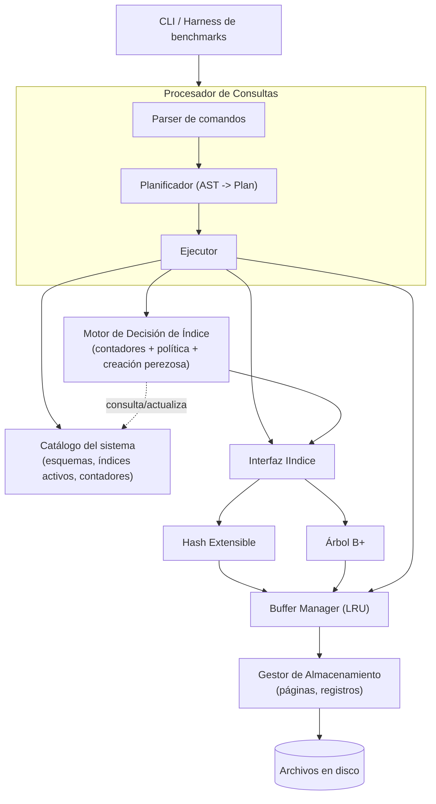

# Mini-SGBD con selección automática de índice según patrón de consulta

> Documento de trabajo para el artículo científico del proyecto final de Base de Datos II.
> Se completa a medida que se avanza en la implementación (ver estado al final de cada sección).

## 1. Título

*Selección automática de estructura de índice (Hash Extensible / B+ Tree) basada en el
patrón de acceso observado por columna: un mini-SGBD adaptativo.*

## 2. Resumen

*(pendiente — se escribe al final, cuando haya resultados de la sección 9)*

## 3. Palabras clave

Sistemas gestores de bases de datos, índices adaptativos, índice hash extensible, árbol B+,
buffer manager, gestión de almacenamiento.

## 4. Introducción

*(pendiente)*

## 5. Trabajos relacionados

*(pendiente — comparar con: índices adaptativos en investigación de bases de datos,
auto-tuning de índices en SGBD comerciales, trabajos clásicos de Hash Extensible y B+ Tree)*

## 6. Arquitectura propuesta

### 6.1 Diagrama de módulos



### 6.2 Responsabilidad de cada módulo

- **Gestor de Almacenamiento**: archivos de datos por tabla, páginas de tamaño fijo (4 KB)
  con organización *slotted page*, registros de longitud fija (simplificación deliberada:
  todos los registros de una tabla ocupan el mismo tamaño, definido por su `Esquema`).
- **Buffer Manager**: buffer pool con reemplazo LRU; todo acceso a páginas pasa por aquí
  (índices y ejecutor nunca tocan `GestorArchivos` directamente).
- **Índices**: interfaz común `IIndice` (`insertar`, `buscarPuntual`, `buscarRango`,
  `eliminar`) implementada por `HashExtensible` y `ArbolBMas`.
- **Motor de Decisión de Índice** *(aporte distintivo)*: contadores de uso por columna
  (`contadorIgualdad`, `contadorRango`), política de umbral (0.7 con `N_MIN = 20` muestras)
  y construcción perezosa del índice elegido.
- **Catálogo**: esquemas de tablas y estado de índices activos por columna; persistente en
  disco en formato de texto plano (una línea por columna, reescritura completa en cada
  cambio — sin versionado ni recuperación ante corrupción, por simplicidad).
- **Procesador de Consultas**: parser de comandos propios, plan de consulta (AST simple) y
  ejecutor que decide *full scan* vs. uso de índice, e instrumenta cada filtro `WHERE` hacia
  el Motor de Decisión.
- **Harness de evaluación**: generador de cargas sintéticas con proporciones configurables
  de consultas punto/rango; compara (a) sin índices, (b) índice fijo único, (c) selección
  automática.

**Estado de implementación:** completado (diseño estable). Un ajuste sobre el diagrama
original: el Buffer Manager se generalizó para identificar páginas por `(archivo, número de
página)` en vez de solo número de página, de modo que un único `GestorBuffer` sea
realmente compartido entre la tabla de datos y cada archivo de índice (fiel al diagrama:
una sola caja "BM" alimentando tanto a los índices como al Gestor de Almacenamiento).

## 7. Diseño del sistema

### 7.1 Formato de página (slotted page)

Página de 4096 bytes. Encabezado de 8 bytes: `numeroPagina` (4B), `numeroSlots` (2B),
`finDatos` (2B, offset donde termina el área de datos ocupada). Los registros se escriben
desde `finDatos` hacia adelante; el directorio de slots crece desde el final de la página
hacia atrás, con entradas de 4 bytes (`offset` 2B, `longitud` 2B; `longitud == 0` marca un
slot borrado). No hay compactación ni reutilización de slots borrados en esta versión —
limitación aceptada conscientemente para mantener el alcance manejable.

### 7.2 Identificación de registros

`RID = {numeroPagina, numeroSlot}`, estable mientras el registro no se elimine (las
actualizaciones no cambian el RID porque los registros son de longitud fija).

### 7.3 Buffer Manager

Pool de marcos (`Marco`) de tamaño configurable. Tabla hash `idPagina -> índice de marco` +
lista doblemente enlazada para el orden LRU (frente = más recientemente usado). El
reemplazo evita marcos con `contadorPines > 0` (páginas fijadas en uso). Al necesitar un
marco: (1) si aún no se alcanzó la capacidad, se crea uno nuevo; (2) si hay un marco libre
sin ocupar (por ejemplo tras un `vaciarTodo()`), se reutiliza directamente; (3) si no, se
recorre la lista LRU desde el menos usado buscando uno con cero pines, escribiendo a disco
si estaba sucio antes de reutilizarlo.

**Nota de depuración:** durante las pruebas se detectó y corrigió un caso (2) faltante —
tras `vaciarTodo()` el gestor buscaba únicamente en la lista LRU y no encontraba marcos
libres, lanzando una excepción de "pool lleno" incluso con todos los marcos disponibles.

### 7.4 Política de decisión de índice

Por columna, contadores acumulados `contadorIgualdad` / `contadorRango`, reseteados cada
vez que se toma o cambia una decisión. Regla: con `N_MIN = 20` consultas mínimas sobre la
columna, si `contadorIgualdad / total >= 0.7` se construye/usa Hash Extensible; si
`contadorRango / total >= 0.7` se construye/usa B+ Tree; si ninguno supera el umbral, no se
crea índice. Histéresis: un índice ya creado solo se reemplaza por el otro tipo si el
patrón contrario sostiene el umbral durante otra ventana completa de `N_MIN` consultas
(evita oscilar entre estructuras por ruido).

### 7.5 Índices paginados: Hash Extensible y B+ Tree

Ambos índices implementan `IIndice` (`insertar`, `buscarPuntual`, `buscarRango`, `eliminar`)
operando sobre bytes ya codificados (`CodificadorClave`), no sobre `Valor` directamente —
así se almacenan en páginas sin que el índice necesite conocer en tiempo de ejecución si la
columna es entera o de texto. `CodificadorClave` convierte cada valor a una secuencia de
bytes de longitud fija comparable con `memcmp`: los enteros se codifican en big-endian con
el bit de signo invertido (para que la comparación sin signo de bytes coincida con la
comparación con signo), y el texto se rellena con ceros a la derecha.

Cada índice es un archivo de páginas propio (`GestorArchivos` propio) pero **comparte el
mismo `GestorBuffer`** que la tabla de datos — un único buffer pool para todo, igual que en
un SGBD real, generalizado para identificar páginas por `(archivo, número de página)` en
vez de solo por número de página.

**Hash Extensible** — página 0: encabezado (`profundidadGlobal`, `longitudClave`,
`paginaDirectorioInicio`, `numeroPaginasDirectorio`); el directorio son N páginas
contiguas de punteros a bucket (1024 entradas por página de 4KB); cada bucket es una
página con `{profundidadLocal, numeroEntradas, entradas[]}`. Al duplicar el directorio se
reserva un bloque de páginas nuevo y se abandona el anterior (sin reciclado de páginas
libres — misma simplificación que en el gestor de almacenamiento). `buscarRango` funciona
pero recorre todos los buckets únicos referenciados por el directorio — a propósito: el
experimento del artículo debe evidenciar que esta estructura no conviene para consultas por
rango frente al B+ Tree.

**B+ Tree** — página 0: metadata (`paginaRaiz`, `longitudClave`); nodos internos
`{esHoja=0, numeroClaves, hijo0, (clave0,hijo1), ...}`; hojas
`{esHoja=1, numeroClaves, siguienteHoja, (clave0,RID0), ...}` enlazadas para recorrido de
rango secuencial. Los splits (de hoja y de nodo interno) se implementan leyendo el nodo
completo a una estructura en memoria, partiéndolo ahí, y reescribiendo ambas páginas desde
cero — más simple y menos propenso a errores que manipular offsets en el lugar. La
inserción propaga el split hacia arriba usando el camino de páginas visitadas durante el
descenso; si la raíz se divide, se crea una raíz nueva. **Simplificación aceptada:**
`eliminar` no fusiona ni redistribuye nodos bajo el mínimo de ocupación (solo hay
rebalanceo en inserción, práctica común en implementaciones académicas de B+ Tree).

**Nota de depuración (patrón de bug repetido):** `GestorBuffer::asignarPaginaNueva` deja la
página recién creada con un pin activo. En tres lugares (inicialización de ambos índices y
el split de bucket del Hash Extensible) se volvía a llamar `fijarPagina`/`escribirNodo`
sobre esa misma página sin liberar el pin inicial primero, duplicando el contador de pines
y filtrándolo para siempre. Con miles de inserciones esto agotaba el pool de buffers
("todos los marcos están fijados") incluso con marcos completamente libres. Se corrigió
liberando explícitamente el pin de `asignarPaginaNueva` antes de cualquier re-fijado
posterior — ver `tests/test_indices.cpp` para la prueba que lo hizo evidente (3000 claves,
pool de 5 marcos compartido entre ambos índices).

### 7.6 Catálogo persistente

`Catalogo` persiste dos cosas de naturaleza distinta en el mismo archivo de texto plano,
distinguidas por un prefijo en cada línea:

- **Esquemas de tabla**: `TABLA,nombre,numColumnas,(columna,TIPO,longitud)*`. Se escribe
  apenas se registra una tabla nueva (`registrarTabla`), así que sobrevive a un reinicio del
  proceso — al construir un `Catalogo` nuevo, `cargarDesdeDisco` relee estas líneas y vuelve
  a abrir el `GestorArchivos` de cada tabla automáticamente, sin que haga falta re-ejecutar
  `CREAR TABLA`.
- **Estado de índice por columna**: `COLUMNA,tabla,columna,tipo_indice,contador_igualdad,
  contador_rango`. Se reescribe por completo, pero no en cada consulta individual — solo
  cuando se cierra una ventana de `N_MIN` consultas (ver 7.7) — para no dominar el tiempo de
  los benchmarks con E/S del catálogo.

Sin journaling ni manejo de corrupción: una línea con un prefijo desconocido o un formato
inesperado simplemente se ignora. (Este esquema de persistencia se agregó después de que el
propio usuario, probando el REPL interactivo, notara que las tablas "desaparecían" al
reiniciar el programa — los datos de las filas ya estaban en disco, pero el esquema para
interpretarlos no. Ver también sección de REPL más abajo.)

### 7.7 Motor de Decisión de Índice (`PoliticaDecision` + `GestorIndices`)

`PoliticaDecision::decidir(contadorIgualdad, contadorRango, tipoActual)` es una función pura
sin estado propio: si el total de consultas acumuladas no llega a `N_MIN=20`, devuelve
`tipoActual` sin cambios (ventana incompleta); si `contadorIgualdad/total >= 0.7` devuelve
`HASH`; si `contadorRango/total >= 0.7` devuelve `BMAS`. Si el patrón es mixto (ninguna
proporción supera el umbral): se mantiene `tipoActual` si ya había un índice construido, o
se elige **B+Tree por defecto** si todavía no había ninguno (`tipoActual == NINGUNO`).

Esta última regla se agregó tras observar en el benchmark (sección 9) que cargas cercanas a
50/50 nunca cruzan el umbral 0.7 y, sin este default, la columna quedaba sin índice para
siempre — mucho peor que *cualquiera* de los dos índices fijos, que ya le ganan claramente a
un recorrido completo incluso "equivocados". La razón de elegir B+Tree y no Hash como
default: **Hash y B+Tree no fallan de forma simétrica** ante el patrón contrario. B+Tree
resuelve una búsqueda puntual en O(log n) — no es óptimo, pero es razonable. Hash no puede
resolver un rango en absoluto: `HashExtensible::buscarRango` degrada a un recorrido completo
de todos los buckets. Ante la duda (patrón mixto, sin evidencia clara), conviene la
estructura cuyo peor caso es menos costoso.

La histéresis descrita en el diseño original no requirió estado adicional para el caso
donde ya hay un índice vigente: como `GestorIndices` **resetea los contadores cada vez que
se cierra una ventana** (haya cambiado el tipo o no), reemplazar un índice ya construido por
el otro tipo exige que el patrón contrario domine una ventana completa nueva — es una
consecuencia directa de reiniciar la ventana en cada evaluación, no un mecanismo aparte.

`GestorIndices` es el orquestador: `registrarAcceso(tabla, columna, tipoFiltro)` incrementa
el contador correspondiente en el `Catalogo` y, si se completa una ventana, aplica
`PoliticaDecision` y —si el tipo decidido difiere del vigente— construye el nuevo índice de
forma perezosa: escanea la tabla completa una vez vía `GestorBuffer`/`Pagina` y puebla la
estructura elegida (`HashExtensible` o `ArbolBMas`) con `(clave codificada, RID)` por cada
registro ocupado. El archivo del índice usa una ruta determinística por columna
(`idx_<tabla>_<columna>.idx`) y se **borra antes de reconstruir**, sin importar si el tipo
cambió o si es una reconstrucción tras reiniciar el proceso — así nunca se arrastran datos
obsoletos de una versión anterior del índice, a costa de no reciclar ese espacio en disco
(misma simplificación que en el resto del proyecto). `obtenerIndiceSiExiste` reconstruye
perezosamente incluso cuando el proceso se reinició: si el catálogo indica un tipo pero el
índice no está cargado en memoria, lo construye en el primer uso.

**Nota de depuración (puntero colgante):** un índice puede destruirse (al cambiar de tipo)
mientras el `GestorBuffer` compartido todavía tiene marcos ocupados apuntando a su
`GestorArchivos`. Como el pool no se entera de que ese archivo va a desaparecer, si nadie lo
avisa quedan marcos con un puntero colgante — la próxima operación sobre ellos (una
evicción, un `vaciarTodo()`) es comportamiento indefinido. Se agregó
`GestorBuffer::cerrarArchivo(archivo)` (vacía y descarta todos los marcos de ese archivo) y
se llama desde el destructor de `HashExtensible`/`ArbolBMas`, antes de que su miembro
`archivo_` se destruya. Esto también reveló, indirectamente, que el buffer pool es
estrictamente *write-back*: los datos insertados no llegan a disco hasta que la página se
desaloja o se llama `vaciarTodo()` explícitamente — un "reinicio del proceso" en las pruebas
tiene que simular un apagado ordenado (`vaciarTodo()`) o el archivo en disco no refleja lo
insertado.

**Estado de implementación:** Gestor de Almacenamiento, Buffer Manager (generalizado para
múltiples archivos), Hash Extensible, B+ Tree, Catálogo y Motor de Decisión completos y
probados (ver `tests/test_almacenamiento_buffer.cpp`, `tests/test_indices.cpp` y
`tests/test_motor_decision.cpp`, este último verificando el ciclo completo: sin índice →
Hash tras consultas puntuales → B+Tree tras consultas de rango → sin cambio con patrón
mixto → persistencia del catálogo → reconstrucción perezosa tras "reiniciar" el proceso).

### 7.8 Procesador de Consultas (Parser + Ejecutor)

**Gramática** (palabras clave insensibles a mayúsculas/minúsculas; nombres de tabla/columna
y contenido de cadenas conservan su capitalización):

```
CREAR TABLA nombre (col1:ENTERO, col2:TEXTO(20), ...)
INSERTAR EN nombre VALORES (v1, v2, ...)
SELECCIONAR * DE nombre [DONDE columna (= v | ENTRE v1 Y v2 | > v | >= v | < v | <= v)]
ELIMINAR DE nombre DONDE columna (= v | ENTRE v1 Y v2 | > v | >= v | < v | <= v)
```

`Parser` es un tokenizador + descenso recursivo de mano, sin dependencias del `Catalogo`:
produce un `PlanConsulta` (AST) a partir del texto, sin conocer ni validar tipos de columna
— eso es responsabilidad del `Ejecutor` en tiempo de ejecución (mantiene los módulos
desacoplados). **Simplificación aceptada:** `>`/`>=` y `<`/`<=` se tratan igual (el límite
queda incluido en ambos casos) — evita tener que calcular "la clave siguiente/anterior" en
espacio de bytes, que es no trivial para columnas de texto codificadas de longitud fija.

`Ejecutor::ejecutar(plan)` despacha según `plan.operacion`. Para SELECCIONAR/ELIMINAR con
filtro, `resolverFiltro` primero llama `GestorIndices::registrarAcceso` (esto es lo que
alimenta al Motor de Decisión — cada filtro resuelto cuenta, use o no finalmente un índice)
y luego pregunta `GestorIndices::obtenerIndiceSiExiste`: si hay índice vigente, lo usa
(`buscarPuntual` para igualdad, `buscarRango` para rango, con
`CodificadorClave::minimo/maximo` como sentinela cuando el rango es abierto); si no, hace un
recorrido completo de la tabla aplicando el filtro en memoria sobre el `Valor` ya
deserializado (no hace falta codificar a bytes en este camino).

**Sincronización de índices en INSERTAR/ELIMINAR:** tras insertar o eliminar una fila,
`actualizarIndicesRegistro` recorre todas las columnas de la tabla y, para cada una que
tenga un índice activo (`GestorIndices::obtenerIndiceSiExiste`), inserta o elimina la
entrada correspondiente. Sin esto, un índice quedaría desactualizado apenas se insertara
una fila después de construirlo — se verificó explícitamente en
`tests/test_consultas.cpp` (insertar tras construido el índice, y encontrar la fila vía
`SELECCIONAR`).

**Limitación aceptada:** `buscarPuntual` (usado para `=`) devuelve solo la **primera**
coincidencia — el índice asume que las búsquedas de igualdad son sobre columnas sin
duplicados. La alternativa (usar siempre `buscarRango(clave,clave)` para `=`) sería
correcta con duplicados pero anularía la ventaja O(1) del Hash frente al recorrido
exhaustivo de `HashExtensible::buscarRango`, que es precisamente lo que el experimento
central del artículo necesita poder medir.

**Estado de implementación:** completo y probado de punta a punta en
`tests/test_consultas.cpp` (25 verificaciones: unidades del parser incluyendo errores de
sintaxis, y un flujo completo con 500 filas reales — recorrido completo antes de que exista
índice, cambio a Hash tras consultas puntuales, cambio a B+Tree tras consultas de rango,
rangos abiertos, e inserción/eliminación posteriores a la construcción del índice
manteniéndolo sincronizado).

## 8. Implementación

*(pendiente — se documentan detalles relevantes de cada módulo a medida que se implementan;
por ahora ver el código en `include/almacenamiento/`, `include/buffer/` y sus fuentes)*

## 9. Experimentos y resultados

### 9.1 Metodología

`benchmarks/main_benchmark.cpp` + `benchmarks/GeneradorCargas.cpp`. Tabla de 20 000 filas
(`id:ENTERO`, `valor:ENTERO`), buffer pool de 50 marcos (chico a propósito frente a las
~137 páginas de datos, para forzar E/S real). Para cada proporción puntual/rango, de 0% a
100% en pasos de 10% (11 puntos), se generan 2000 consultas `SELECCIONAR ... DONDE id ...`
sintéticas con semilla fija (reproducibles) — punto: `id = v` con `v` uniforme en
`[0, 19999]`; rango: `id ENTRE v Y v+ancho` con ancho variable alrededor de 20. La misma
secuencia de 2000 consultas se ejecuta, sin cambios, contra cuatro estrategias:

- **sin_indices**: `ModoGestorIndices::SIN_INDICES` — recorrido completo siempre.
- **fijo_hash** / **fijo_bmas**: `ModoGestorIndices::TIPO_FIJO` — construye ese tipo apenas
  se accede por primera vez a la columna, sin mirar el patrón.
- **seleccion_automatica**: comportamiento normal (`PoliticaDecision` + ventanas de `N_MIN`).

Cada estrategia corre con su propio `Catalogo` (contadores en cero) y su propio
`GestorBuffer` (caché en frío), pero **todas leen el mismo archivo de datos ya poblado**
—no hay `INSERTAR`/`ELIMINAR` en el benchmark— así que el tiempo medido aísla el costo de
resolución del filtro (índice vs. recorrido completo), no el de poblar la tabla. Métrica
principal: tiempo total (ms) para las 2000 consultas; también se registra la tasa de
aciertos del buffer.

### 9.2 Resultados (ver `benchmarks/resultados_benchmark.csv` para la corrida completa)

| Prop. puntual | sin_indices | fijo_hash | fijo_bmas | **auto** |
|---:|---:|---:|---:|---:|
| 0.0 | 6390 | 3278 | 1093 | 1279 |
| 0.1 | 7303 | 3257 | 1084 | 1201 |
| 0.2 | 6295 | 2638 | 1099 | 1218 |
| 0.3 | 6276 | 2391 | 1168 | 1295 |
| 0.4 | 6475 | 2127 | 1141 | 2387 |
| 0.5 | 6736 | 1697 | 1140 | 5662 |
| 0.6 | 6927 | 1510 | 1172 | 3498 |
| 0.7 | 6828 | 1039 | 1121 | 2032 |
| 0.8 | 6834 | 778 | 1217 | 1969 |
| 0.9 | 6539 | 420 | 1222 | 508 |
| 1.0 | 6213 | 58 | 1118 | 188 |

(tiempo total en ms para 2000 consultas; corrida en la máquina de desarrollo, no en
hardware dedicado — los valores absolutos importan menos que las proporciones relativas
entre estrategias)

**Verificación automática incluida en el propio harness:** al final de la corrida se
calcula, para cada proporción, si `seleccion_automatica` fue la estrategia con el tiempo
**máximo** (la peor). Resultado: **nunca lo fue, en ninguno de los 11 puntos del
espectro** — es la comprobación empírica central del aporte del proyecto.

### 9.3 Observaciones

1. **En los extremos (0.0–0.2 y 0.8–1.0)** la selección automática queda muy cerca del
   mejor índice fijo posible para ese patrón (p.ej. en 1.0: 188ms vs. 58ms del Hash óptimo;
   en 0.0: 1279ms vs. 1084ms del B+Tree óptimo), y muy por debajo tanto de "sin índices"
   como del índice fijo *equivocado* para ese patrón.
2. **Zona intermedia (0.4–0.7):** el tiempo de `auto` sube notoriamente (hasta 5662ms en
   0.5) sin llegar nunca a superar a `sin_indices`. La causa no es la "zona muerta" que
   motivó el default a B+Tree (eso ya está resuelto), sino **ruido de muestreo cerca del
   umbral**: con ventanas de solo 20 consultas, una proporción real de 0.4 o 0.6 todavía
   tiene probabilidad no despreciable de que una ventana particular cruce el 0.7 por puro
   azar, disparando una reconstrucción de índice (costosa: recorrido completo de la tabla)
   que después se revierte en la ventana siguiente. Este *thrashing* cerca del borde del
   umbral es una limitación real y medible del enfoque de ventana fija — ver Discusión.
3. **Hash fijo** es imbatible en 1.0 (58ms) pero se degrada progresivamente a medida que
   aumenta la proporción de rango, hasta ser la segunda peor estrategia en 0.0 (3278ms,
   solo detrás de "sin índices") — coherente con que su `buscarRango` es un recorrido
   completo de buckets.
4. **B+Tree fijo** es notablemente estable en todo el espectro (1084–1222ms) — resuelve
   puntuales en O(log n) razonablemente bien y rangos de forma óptima — pero nunca es tan
   rápido como Hash fijo en el extremo puramente puntual (58ms vs. 1118ms en 1.0).

## 10. Discusión

*(pendiente de redacción en prosa — puntos a desarrollar, ya respaldados por datos de la
sección 9)*

- El resultado central: la selección automática **nunca fue la peor opción** en el barrido
  completo 0–100%, mientras que **cada índice fijo sí lo fue** en el extremo contrario a su
  fortaleza (Hash fijo: peor en 0.0 salvo "sin índices"; ninguno de los dos fijos alcanza el
  óptimo del otro extremo). Este es el argumento cuantitativo del aporte distintivo.
- Limitación identificada y corregida en el camino: un umbral fijo (0.7) sin un valor por
  defecto para la zona mixta deja columnas con patrones cercanos a 50/50 sin índice
  indefinidamente — peor que cualquiera de los dos índices fijos. Se corrigió con un
  default a B+Tree (justificado por la asimetría de peores casos entre Hash y B+Tree), pero
  vale la pena discutir la alternativa considerada y descartada (bajar el umbral) y por qué
  se prefirió no tocar un parámetro ya validado.
- Limitación NO corregida (candidata a "trabajo futuro"): *thrashing* cerca del borde del
  umbral por ruido de muestreo con ventanas de tamaño fijo (`N_MIN=20`). Alternativas para
  discutir sin implementar: ventana más grande (menos sensible al ruido, pero más lenta en
  adaptarse a un cambio real de patrón), histéresis explícita con un umbral de salida más
  exigente que el de entrada, o promedio móvil ponderado en vez de ventanas discretas.
- Costo de la construcción perezosa: cada cambio de tipo de índice implica un recorrido
  completo de la tabla — barato una vez, pero es exactamente lo que causa el costo del
  *thrashing* del punto anterior. Vale la pena cuantificar cuántas reconstrucciones ocurrieron
  en la zona 0.4–0.7 vs. en los extremos (instrumentar un contador en `GestorIndices` si se
  quiere ese dato exacto para el artículo).

## 11. Conclusiones

*(pendiente)*

## 12. Referencias

*(pendiente)*
